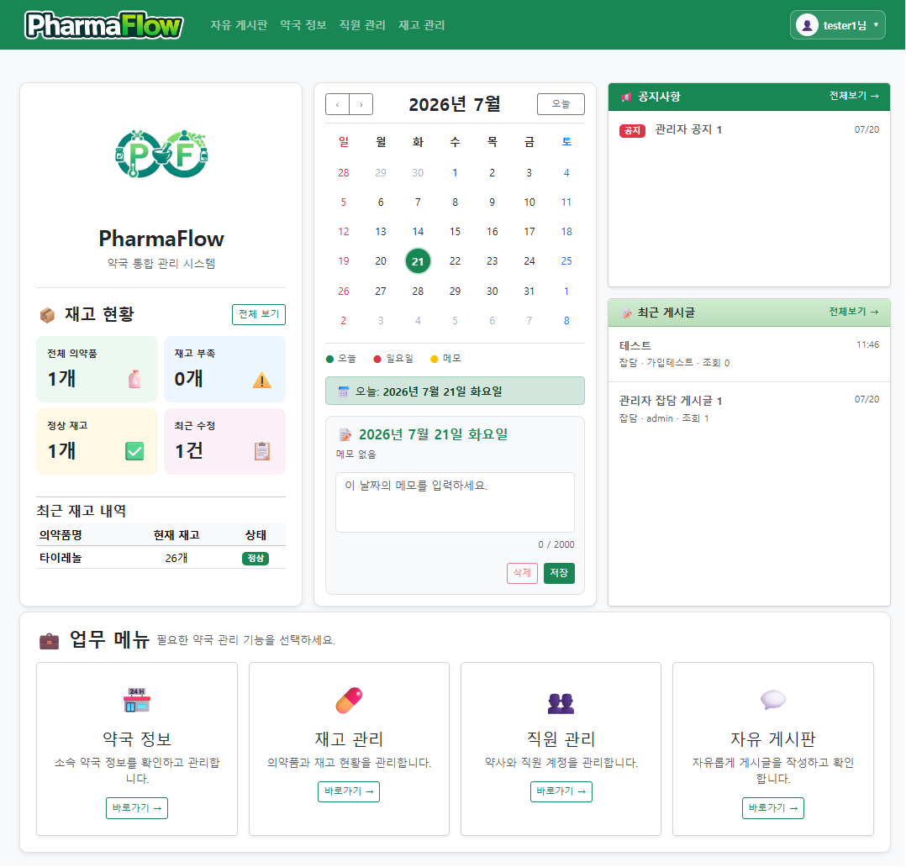
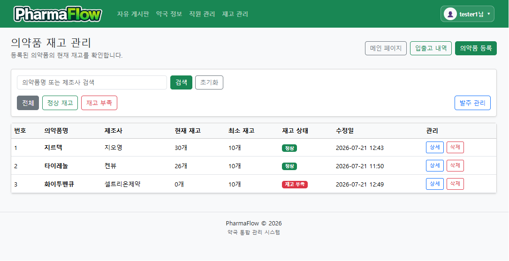
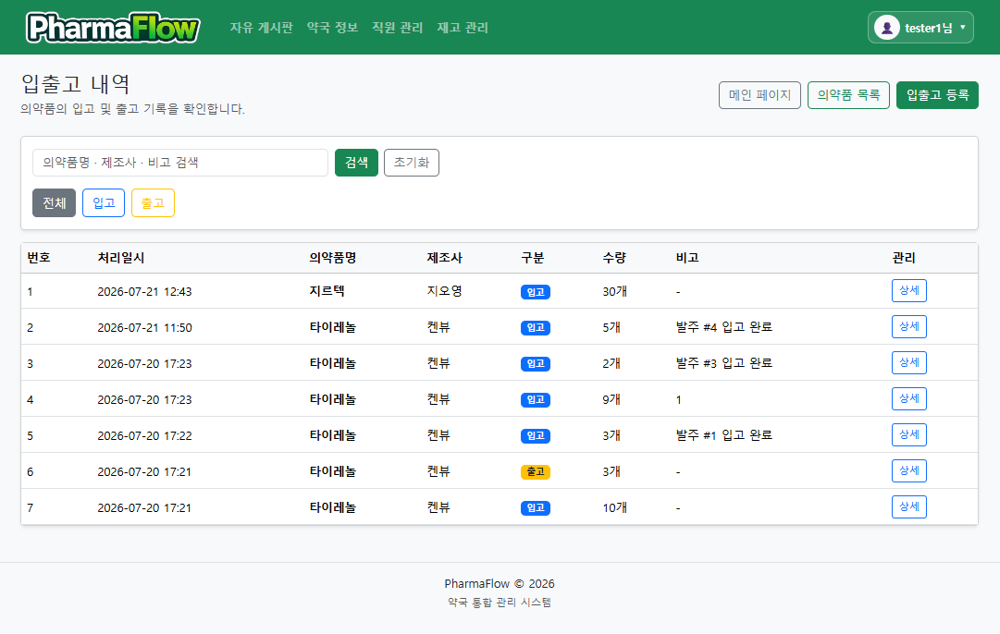
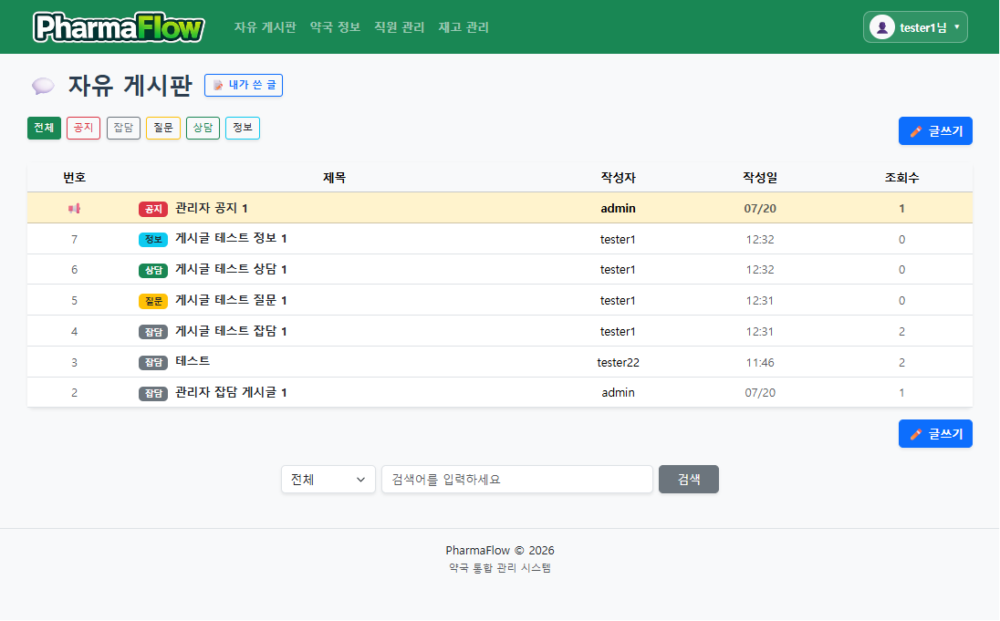
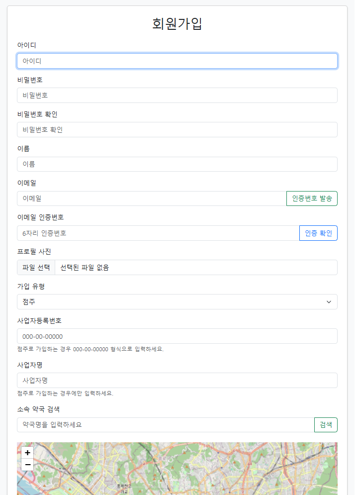

<p align="center">
    
</p>

<h1 align="center">PharmaFlow</h1>

<p align="center">
💊 약국 통합 관리 시스템
</p>

<p align="center">
Django · MariaDB · Nginx · Gunicorn · NFS
</p>

---

# 📌 프로젝트 소개

**PharmaFlow**는 약국 업무를 효율적으로 관리하기 위한 웹 기반 **약국 통합 관리 시스템**입니다.

회원 관리, 점주 승인, 약국 관리, 의약품 재고 관리, 입출고 관리, 자유 게시판 기능을 하나의 시스템에서 제공합니다.

---

# 🎯 프로젝트 목적

- 약국 업무의 전산화
- 재고 및 입출고 관리 효율화
- 약국 관계자 간 정보 공유
- 실제 운영 환경 기반 서버 구축

---

# 👨‍💻 팀 구성

| 이름 | 담당 |
|------|------|
| **고건희** | Accounts, Core, 사용자 인증, 약국 관리, 서버 구축 |
| **서보성** | Inventory, 의약품/재고/입출고/발주 관리 |
| **홍성빈** | Consultations, Prescriptions, 게시판 및 처방 기능 |

---

# 🛠 기술 스택

- Python 3.12
- Django
- HTML5
- CSS3
- Bootstrap 5
- JavaScript
- MariaDB
- Ubuntu Server 24.04
- Gunicorn
- Nginx
- NFS
- Git
- GitHub
- GitHub Actions

---

# ✨ 주요 기능

- 회원가입 / 로그인
- 점주 승인 시스템
- 이메일 인증
- HIRA API 약국 검색
- 약국 관리
- 직원 관리
- 의약품 등록 및 관리
- 재고 관리
- 입출고 관리
- 발주 관리
- 자유 게시판
- 시스템 로그

---

# 📷 주요 화면

## 🏠 메인 화면

<p align="center">
    
</p>

메인 대시보드에서 재고 현황, 일정 관리, 공지사항, 최근 게시글 및 주요 업무 메뉴를 한 화면에서 확인할 수 있습니다.

---

## 💊 의약품 재고 관리

<p align="center">
    
</p>

의약품 등록, 검색, 재고 현황 및 재고 부족 여부를 확인하며 발주 기능과 연계하여 효율적인 재고 관리를 제공합니다.

---

## 📦 입출고 관리

<p align="center">
    
</p>

의약품의 입고 및 출고 내역을 관리하며 입출고 기록과 발주 완료 내역을 확인할 수 있습니다.

---

## 💬 자유 게시판

<p align="center">
    
</p>

약국 관계자 간 정보 공유를 위한 게시판으로 공지사항, 질문, 상담, 정보, 잡담 카테고리를 제공합니다.

---

## 👤 점주 회원가입

<p align="center">
    
</p>

점주 회원가입 시 사업자등록번호, 사업자명, 이메일 인증 및 지도 기반 약국 검색 기능을 제공합니다.

---

# 📁 프로젝트 구조

```text
PharmaFlow/
├── accounts/
├── consultations/
├── core/
├── deploy/
├── images/
├── inventory/
├── mysite/
├── prescriptions/
├── static/
├── templates/
├── README.md
├── manage.py
└── requirements.txt
```

---

# 🖥 서버 구성

```text
                    Client
                       │
                 HTTP Request
                       │
                   Nginx
                       │
                  Gunicorn
                       │
                    Django
             ┌─────────┴─────────┐
             │                   │
         MariaDB               NFS
      (데이터베이스)        (미디어 저장소)
```

---

# 🚀 실행 방법

```bash
python -m venv djangoenv

source djangoenv/bin/activate

pip install -r requirements.txt

python manage.py migrate

python manage.py runserver
```

---

# ⚙ 운영 기능

- NFS 기반 미디어 저장
- MariaDB 백업
- NFS 백업
- Logrotate
- 환경변수 분리
- GitHub Actions(CI)

---

# 📄 운영 문서

```
deploy/SECURITY_AND_SETUP.md
```

---

# 📜 License

본 프로젝트는 교육 및 팀 프로젝트 목적으로 제작되었습니다.
