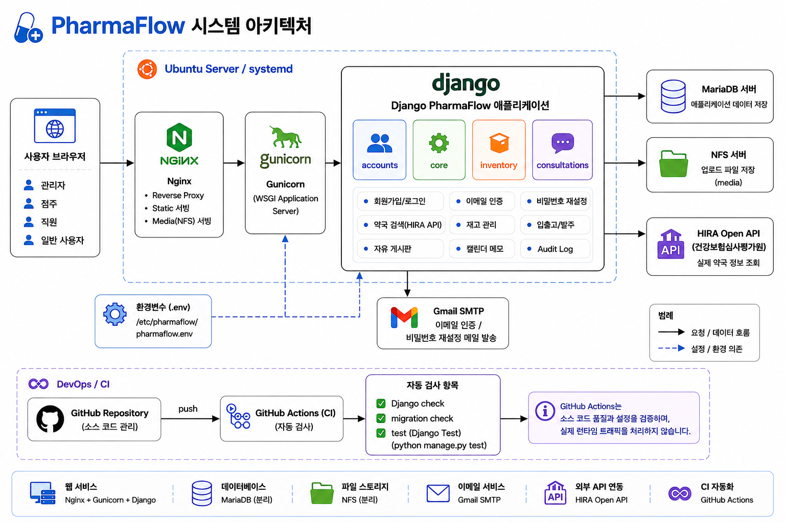

  

<h1 align="center">PharmaFlow</h1>

💊 약국 통합 관리 시스템

Django · MariaDB · Nginx · Gunicorn · NFS

---

# 📌 프로젝트 소개

**PharmaFlow**는 약국 업무를 효율적으로 관리하기 위한 웹 기반 약국 통합 관리 시스템입니다.

회원 관리와 약국 관리부터 의약품 재고, 입출고, 발주, 자유 게시판,
일정 관리까지 하나의 시스템에서 수행할 수 있도록 설계되었습니다.

또한 HIRA Open API, Gmail SMTP, Leaflet 지도, MariaDB, NFS,
Gunicorn, Nginx를 연동하여 실제 운영 환경을 고려한 프로젝트입니다.

---

# 🏗 시스템 아키텍처

  

PharmaFlow는 **Nginx → Gunicorn → Django** 구조를 기반으로 사용자 요청을 처리합니다.

데이터는 **MariaDB 서버**에 저장하고, 업로드 파일은 **NFS 파일 서버**에 저장하여 웹 서버와 저장소를 분리하였습니다.

또한 **HIRA Open API**를 이용하여 실제 약국 정보를 조회하며,
**Gmail SMTP**를 이용한 이메일 인증 및 비밀번호 재설정 기능을 제공합니다.

개발 과정에서는 **GitHub Actions(CI)** 를 활용하여 프로젝트 설정 검사,
마이그레이션 검사 및 테스트를 자동으로 수행하는 개발 자동화 환경을 구축하였습니다.

---

# ✨ 주요 기능

- 회원가입 / 로그인
- 이메일 인증
- 비밀번호 찾기
- HIRA API 약국 검색
- 약국 관리
- 직원 관리
- 의약품·재고·입출고·발주 관리
- 자유 게시판
- 첨부파일 업로드 및 다운로드
- 일정 관리
- Audit Log

---

# 📷 주요 화면

## 🏠 메인 대시보드

  

---

## 💊 의약품 재고 관리

  

---

## 📦 입출고 관리

  

---

## 💬 자유 게시판

  

---

## 👤 점주 회원가입

  

---

# 🛠 기술 스택

- Python 3.12
- Django 6.0.6
- Bootstrap 5
- JavaScript
- MariaDB
- Nginx
- Gunicorn
- NFS
- Leaflet
- OpenStreetMap
- HIRA Open API
- Git / GitHub / GitHub Actions

---

# 🔐 보안 기능

- Django CSRF 보호
- 환경변수(.env) 분리
- Gmail SMTP 이메일 인증
- 비밀번호 재설정
- 권한 기반 접근 제어

---

# 📈 프로젝트 특징

- 실제 운영 환경 기반 서버 구축
- MariaDB 분리 서버
- NFS 기반 파일 저장
- HIRA 공공데이터 API 연동
- Bootstrap 기반 반응형 UI
- GitHub 브랜치 협업 및 GitHub Actions(CI)
- Django 인증 시스템(Custom User) 확장
- Audit Log를 통한 작업 이력 관리

---

# 📚 Data Source

- 약국 정보 조회 기능은 건강보험심사평가원(HIRA) Open API를 활용하였습니다.
- 공공데이터포털(Open API)를 통해 제공되는 건강보험심사평가원 약국 정보를 사용하였습니다.

---

# 📜 License

본 프로젝트는 교육 및 학습을 위한 팀 프로젝트로 제작되었습니다.

상업적 이용을 목적으로 하지 않습니다.

---

# 👥 Team

- 고건희 : Accounts / Core / 인프라 구축
- 서보성 : Inventory / MariaDB 구축
- 홍성빈 : Consultations / NFS 구축

---

# 📚 Project Purpose

본 프로젝트는 Django 기반 웹 개발뿐 아니라

- 서버 구축
- 데이터베이스 분리
- 파일 스토리지 구축
- 이메일 인증
- 외부 API 연동
- GitHub 협업
- CI 자동화

등 실제 운영 환경을 고려한 약국 통합 관리 시스템 구축을 목표로 진행되었습니다.
